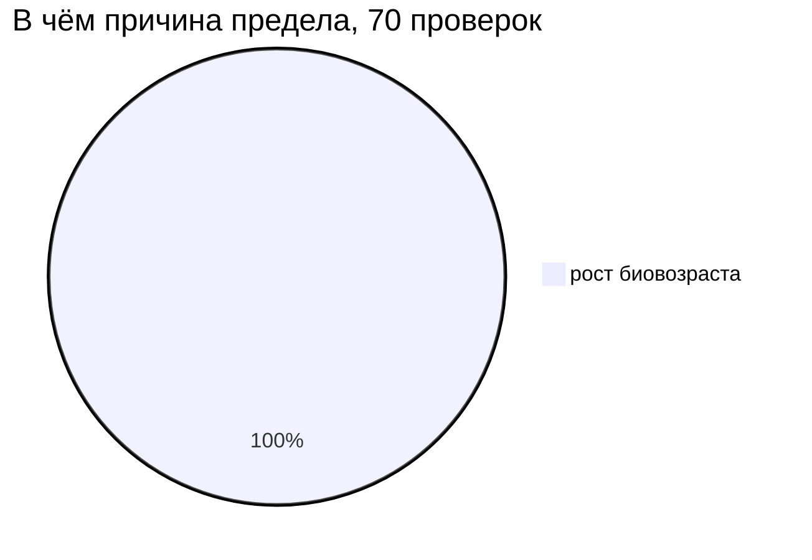
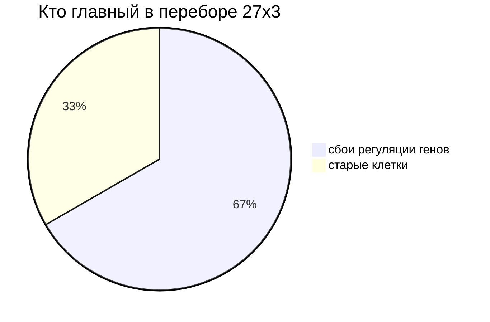

# Исследование долголетия человека — презентация прогресса


[](https://github.com/VohminV/human-longevity-research/actions/workflows/ci.yml)


> **Вопрос проекта:** можно ли построить модель человека, достаточно подробную,
> чтобы проверять на ней механизмы старения и понять, какие вмешательства
> замедляют, останавливают или обращают разрушение организма?
>
> **Честное правило:** «бессмертие» — это гипотеза для проверки, а не обещание.
> Модель не подгоняем под ответ. Отрицательный результат — тоже результат.
>
> Названия из кода (файлы, параметры, статусы) даны `моноширинным шрифтом`.
> Остальной текст — на русском, простыми словами.

**Как читать дальше:** каждый слайд устроен одинаково — что делали, что получили,
что это значит. Непонятные слова разобраны в словарике ниже.

Краткий словарик:

- **Сид (`seed`)** — стартовое число для случайности. Один сид = повторяемый результат.
- **Биовозраст** — внутренний износ в модели, отличается от паспортного возраста.
- **Драйвер** — одна из 8 причин старения в модели (ДНК, гены, белки, митохондрии, старые клетки, стволовые, воспаление, рак).
- **Перебор по сетке** — много запусков подряд. Запись «8×3» значит: 8 вариантов, каждый по 3 раза.
- **Аблация** — опыт «убираем одну деталь и смотрим, что changed».
- **Критерии `v1`–`v6`** — строгие проверки «остановили ли деградацию». Пока не пройден ни один.
- **Стена (`wall`)** — устойчивый предел, в который упираемся.
- **HYP-0** — главная гипотеза: «есть правило, которое останавливает деградацию». Статус: `hypothesis_not_proven` (не доказана).

Навигация: [Архитектура](#слайд-1-архитектура) ·
[Прогресс](#слайд-2-прогресс) · [Клетка](#слайд-3-клетка) ·
[Ткань](#слайд-4-ткань) · [Орган](#слайд-5-орган) ·
[Организм](#слайд-6-организм) · [Прочность](#слайд-7-прочность) ·
[Причины](#слайд-8-причины) ·
[Органы](#слайд-9-органы) · [Сеть](#слайд-10-сеть-органов) ·
[Обратимость](#слайд-11-обратимость) · [Граница](#слайд-12-граница) ·
[Составная стена](#слайд-13-составная-стена) · [Остаток](#слайд-14-остаточные-причины) ·
[Аудит](#слайд-15-аудит) · [Цифры](#слайд-16-цифры) ·
[Сверка](#слайд-17-сверка-с-биологией) · [HYP-0](#слайд-18-hyp-0) ·
[Дальше](#слайд-19-что-дальше) · [Запуск](#слайд-20-как-повторить)

---

## Слайд 1. Архитектура

Как всё связано:


```text
СНАЧАЛА ПРАВИЛЬНАЯ НАУЧНАЯ МОДЕЛЬ.
ПОТОМ СИМУЛЯТОР.
ПОТОМ ЭКСПЕРИМЕНТЫ.
ПОТОМ ПРОВЕРКА ГИПОТЕЗ.
```

Простыми словами: модель отделена от данных, запуски повторяемы (контрольные точки),
в ядре только стандартная библиотека, без тяжёлого машинного обучения.

---

## Слайд 2. Прогресс

Этапы 1–9, подробности — в `docs/ROADMAP.md`.

```text
Этапы 1–8:  22 из 22 завершены
Этап 8.5:   поиск «главного рубильника» — только документы, решение = review
Этап 9:     прототип сохранения и отката повреждений — работает, но чуда нет
HYP-0:      hypothesis_not_proven — честный статус во всех отчётах
Тесты:      600 проходят (повторяемость, логика, контрольные точки)
```

| Этап | Статус | Что это значит простыми словами |
|---|---|---|
| 1 — Научная основа | ✅ | Записали допущения, устройство, список источников |
| 2 — Клетка | ✅ | Модель клетки: деление, смерть, происхождение, повторы по сиду |
| 3 — Ранний рост | ✅ | Сверили с данными — модель не сошлась, зафиксировали честно |
| 3.5 — Цикл клетки | ✅ | Цикл зависит от стадии, расхождение частично сгладили (модель C) |
| 3A — Ткань | ✅ | Ткань из отсеков + правило замены клеток |
| 3B — Карта устойчивости | ✅ | Есть широкое «плато», где замена держится, и угол, где всё рушится |
| 3C — Граница | ✅ | Жёсткий контроль ломается по стволовым, мягкий — по каркасу ткани |
| 4A — Орган | ✅ | Орган падает из-за общего ресурса, даже если ткани целы |
| 4B — Координация | ✅ | Ни один умный режим не лучше простого «не мешать» |
| 4C — Отложенная помощь | ✅ | Механика работает, выигрыша в жизни нет |
| 4D — Восстановление | ✅ | Само восстановление помогает, его урезание вредит |
| 5A — Организм | ✅ | Лучшее гибкое управление: 117.8 / 100.2 лет, остановить старение — нигде |
| 5B — Прочность + стресс | ✅ | Везде упираемся в рост биовозраста (70 из 70 проверок) |
| 6A — Органы | ✅ | Упрощённые органы + ресурсы, лучшее 104.8, проверка `v3` — нигде |
| 6B — Сеть органов | ✅ | Связи + обратные связи, лучшее 76.8, проверка `v4` — нигде |
| 6C — Обратимость | ✅ | Делим урон на обратимый и необратимый, лучшее 69.8, проверка `v5` — нигде |
| 6D — Граница | ✅ | Убрали переход в необратимое — наклон в норме, но проверка всё равно не пройдена |
| 6E — Составная стена | ✅ | Резкой границы нет, стена составная: `compound_residual_wall` |
| 6F — Остаток | ✅ | Гасили причины по одной и вместе — не помогло, стена распределённая |
| 7 — Аудит | ✅ | Меняли параметры и критерии — вердикт тот же: `robust_diffuse_wall` |
| 8 — Сверка с биологией | ✅ | 13 согласий, 9 расхождений, 8 идей (P0–P6), вывод: нужны новые механизмы |
| 8.5 — «Главный рубильник» | ✅ (только документы) | 6 документов, ~19 кандидатов, ничего не найдено |
| 9 — Резервная копия | ✅ (прототип) | Сохранение + откат + чистка, перебор 54×3 — проверка `v6` нигде, жизнь 67.5–68.8 |
| 9b — Кто виноват | ✅ | Убирали 8 причин по одной: лучшее −2.8%, остальное почти ноль |
| Дальше (шаги 9–16) | ⏳ | План поиска «рубильника» — только отдельными решениями |

---

## Слайд 3. Клетка

Этапы 1, 2, 3, 3.5. Вопрос: «умеем ли мы правдоподобно растить начало жизни?»

- Сделали минимальную модель клетки: состояния, деление, смерть, кто от кого произошёл.
- Добавили несинхронные циклы и вехи развития, сверили с данными.
- **Честный итог:** по срокам стадий и числу клеток модель не сошлась с данными.
  Зафиксировали как `MODEL MISMATCH` в `docs/CALIBRATION.md`.
- Этап 3.5 частично сгладил расхождение за счёт зависимости цикла от стадии.

Что это значит: фундамент есть, но уже на старте видно — модель упрощена, дальше это будет важно.

---

## Слайд 4. Ткань

Этапы 3A–3C. Вопрос: «есть ли режимы замены клеток, при которых ткань стабильна?»

- Ткань состоит из отсеков: стволовые, рабочие, повреждённые, старые клетки + каркас, сосуды, иммунитет.
- Перебрали режимы «доля × частота»: есть широкое плато стабильности, при слишком агрессивной замене — обвал.
- Причина обвала зависит от строгости контроля: жёсткий — кончаются стволовые, мягкий — разваливается каркас.
- **Вывод:** локально стабильные правила замены есть, но замена — это ещё не омоложение всего организма, на HYP-0 это не влияет.

---

## Слайд 5. Орган

Этапы 4A–4D. Вопрос: «помогает ли умная координация внутри органа?»

- Орган собрали из двух тканей + общий запас на сосуды и иммунитет.
- Проверили: урезание по ресурсам, приоритеты, иммунный сторож, отложенную помощь, отдельное восстановление.
- **Вывод ветки (честный отрицательный):** в этой модели «не мешать» остаётся лучшим.
  Умная координация не выигрывает.
- Полезное побочное: само восстановление стабилизирует, а его урезание создаёт дефицит.
  Этот урок ушёл в правила для организма.

---

## Слайд 6. Организм

Этап 5A. Вопрос: «как долго проживёт целый организм и что продлевает жизнь?»

- Жизнь от эмбриона до старости, 8 важных систем, биовозраст отдельно от паспортного.
  Смерть — от отказа систем, а не по таймеру.
- 8 типов вмешательств (у каждого польза и цена), 10 готовых правил, плюс автоматический подбор.

| Правило | Жизнь | Здоровая жизнь | Чем кончилось |
|---|---|---|---|
| без вмешательств | 68.0 | 61.8 | отказ нескольких систем сразу |
| ремонт молекул | 74.5 | 68.0 | то же |
| комбинированное | 80.5 | 73.0 | то же |
| **гибкое по порогам** | **117.8** | **100.2** | отказ систем (рак выше в 3.3 раза) |
| лучшее из подбора | 96.2 | 84.8 | — |

- **Вывод:** реагировать на состояние лучше, чем действовать по расписанию.
  Но правила, которое останавливает старение, **не найдено** (0 из 27).

---

## Слайд 7. Прочность

Этап 5B. Вопрос: «а если добавить случайность, шум и стрессы — вывод устоит?»

- Проверяли на разных сидах, с шумом в параметрах, 7 видов резких шоков, горизонт 250 лет, 9 сценариев стресса.
- Порядок правил по эффективности не меняется. Самый опасный стресс — токсичность.
  Осторожное гибкое правило режет рак на 24% без потери лет жизни.



- **Вывод:** причина предела везде одна — растёт биовозраст. Не рак, не запасы, не стресс.

---

## Слайд 8. Причины

Этап 5C. Вопрос: «какая именно причина старения тянет вниз сильнее всего?»

- Разложили биовозраст на 8 причин. Поставили полузапрет на жульничество:
  нельзя просто «обнулить возраст», есть точка взросления `adult_age_setpoint`.
- 12 точечных вмешательств, у каждого цена, риск и затухание эффекта.

| Правило | Жизнь | Наклон биовозраста | Кто мешает больше всего |
|---|---|---|---|
| базовое | 66.8 | 0.736 | старые клетки |
| только чистка старых | 67.0 | 0.620 | сбои регуляции генов |
| только регуляция | 67.0 | 0.645 | старые клетки (рак 1.45) |
| **комбинированное** | **70.8** | **0.417** | сбои регуляции |
| лучшее из подбора | 72.2 | — | проверка `v2` не пройдена нигде |



- **Вывод:** комбинация почти вдвое снижает наклон, но до остановки далеко.
  Чинишь одну причину — предел переезжает на следующую.

---

## Слайд 9. Органы

Этап 6A. Вопрос: «что если системы тела частично зависят от упрощённых органов?»

- 8 упрощённых моделей органов + 4 общих ресурса (кровь, иммунитет, обмен, ремонт) + 5 режимов координации.
- Часть причин старения теперь частично вытекает из состояния органов.

| Правило | Жизнь | Здоровая жизнь | Предел |
|---|---|---|---|
| базовое с органами | 82.8 | 71.8 | рост биовозраста |
| поддержка органов | 88.0 | 76.0 | рост биовозраста |
| **комбинированное** | **101.5** | **87.2** | рост биовозраста |
| гибкое между масштабами | 97.5 | 82.2 | рост биовозраста |
| лучшее из подбора (12×3) | 104.8 | — | `v3` нигде |

- Координация не выигрывает у независимой. Ремонт — самый важный ресурс.
- Стресс-проверка 3×7×3: порядок тот же, `v3` нигде.

---

## Слайд 10. Сеть органов

Этап 6B. Вопрос: «что меняют связи между органами и обратные связи?»

- 12 связей (сосуды, иммунитет, обмен, сигналы и др.) + 7 петель обратной связи
  + жёсткие пределы (энергия, информация, мутации и др.) + сетевой биовозраст.
- База стала тяжелее: 82.8 → 67.0. Связи — это реальная нагрузка.
  Самая влиятельная — сердце и сосуды → мозг.

| Правило | Жизнь | Здоровая жизнь | Предел |
|---|---|---|---|
| базовое с сетью | 67.0 | 58.2 | рост биовозраста |
| поддержка сети | 73.0 | 65.0 | рост биовозраста |
| **комбинированное** | **76.5** | **68.8** | рост биовозраста |
| гибкое сетевое | 76.8 | 70.2 | рост биовозраста |
| лучшее из подбора | 75.2 | 67.5 | `v4` нигде |

- Все 6 режимов координации дали 76.5 — выигрыш 0.0. Снова «не мешать» не хуже.
- Ремонт опять самый важный, энергия сама по себе исход не меняет.

---

## Слайд 11. Обратимость

Этап 6C. Вопрос: «а если разделить урон на обратимый и необратимый?»

- Для каждой причины и органа завели split: `урон = обратимый + необратимый`.
  Добавили переход одного в другое (конверсия), потолок ремонта, долги
  (информация, мутации, ниша, энтропия).
- 9 новых вмешательств: чистка, сдерживание, профилактика, ремонт необратимого и др.

| Правило | Жизнь | Здоровая жизнь | Стена |
|---|---|---|---|
| базовое | 67.0 | 58.2 | копление необратимого |
| только профилактика | 68.2 | 59.2 | рост биовозраста |
| только чистка | 69.0 | 60.5 | рост биовозраста |
| только ремонт необратимого | 67.0 | 58.2 | потолок не задет |
| **профилактика + чистка** | **69.5** | **60.5** | копление необратимого |
| агрессивный разворот | 69.0 | 60.5 | растут долги |
| сберегающее мозг | 69.8 | 61.0 | держится связность |
| лучшее из подбора | 68.8 | 60.2 | `v5` нигде |

- Обратимый наклон держится (0.002–0.003), необратимый — нет (0.003–0.005 при допуске 0.004).
  Скорость конверсии 0.05 роняет жизнь 69.5 → 60.5 (−9 лет).
- Потолок ремонта не является пределом — правила его даже не выбирают.
  Координация 4×3 — везде 69.5.

---

## Слайд 12. Граница

Этап 6D. Вопрос: «можно ли подавить поток в необратимое и пройти проверку?»

- Это диагностика, а не новая биология. Включаемый модуль `boundary_probe_model`:
  крутим ручки конверсии, накопления, потолка, отключаем части по одной.
- Раскладываем наклон на части, ищем, кто главный.

| Опыт | Жизнь | Наклон необратимого | Проверка `v5` |
|---|---|---|---|
| обычно | 69.5 | 0.00536 | не пройдена |
| конверсия = 0 | 69.5 | 0.00082 (в норме!) | не пройдена |
| своё накопление = 0 | 69.5 | 0.00501 | не пройдена |
| оба подавлены | 69.5 | ~0.0008 | не пройдена |
| высокий потолок | 69.5 | — | не пройдена |

- Убрали конверсию — необратимый наклон в норме, но проверка всё равно не пройдена:
  предел переехал на общий биовозраст. Это «вторая стена за первой».
- Кто главный: обычно — конверсия и истощение стволовых; при нулевой конверсии —
  своё накопление и повреждения ДНК; при обоих подавленных — долги по информации.
- Стена: `parametric_irreversibility_wall` — часть подавили, а целое не прошли.

---

## Слайд 13. Составная стена

Этап 6E. Вопрос: «а вдруг стена — это узкий эффект параметров и рядом есть резкая граница?»

- Перебор резкой границы 8 значений × 3 сида (от 0.0 до 1.0): `v5` не пройдена нигде,
  даже при 1e-6. Резкой границы и порога нет. При больших значениях правит конверсия,
  при малых — долги по информации.
- Разбор биовозраста: общий наклон ≈ 1.33, главный вклад — поломки белков и обмена (0.69),
  дальше истощение стволовых (0.23). Остаток −0.014, то есть объяснили ~99%. Значимых источников — 3.
  Картина не меняется при аблациях.
- Чувствительность к шагу и точности (60 запусков): везде стабильно, `v5` не пройдена в 36 из 36.
- Итог: `compound_residual_wall` — необратимое подавлено, проверка не пройдена,
  предел — рост биовозраста, источников остатка минимум 2.

---

## Слайд 14. Остаточные причины

Этап 6F. Вопрос: «если точечно придавить главные причины старыми средствами — стена спадёт?»

- Без новой биологии, только ручками модели: гасим топ-причины наклона
  (белки+обмен, стволовые) на шкалах 1.0 / 0.5 / 0.25 / 0.0 и в комбинациях.
  Перебор 15×3 + обход всех групп 14×3. Шкала 1.0 = без изменений, для контроля.

| Режим | `v5` | Наклон | Смена причины? |
|---|---|---|---|
| контроль | не пройдена | 1.33 | — |
| одиночки + комбинации | не пройдена | −0.6% максимум | нет |
| все 6 групп по одной | не пройдена | −8.5% максимум | нет |
| убрать всё вместе | не пройдена | −17% (1.33 → 1.10) | нет |

- `v5` не пройдена в 29 из 29. Главный источник везде один и тот же.
  Порог заметного эффекта (20%) не взят нигде.
- Стена: `diffuse_residual_wall` — предел размазан по многим каналам,
  а не сидит в одном месте. Уверенность средняя. HYP-0 не доказана.

---

## Слайд 15. Аудит

Этап 7. Вопрос: «а вдруг вывод зависит от того, как мы сформулировали проверку?»

- Крутили параметры 23×3: веса главных причин, масштабы справочников, комбинации.
  Шкала 1.0 = контроль, всё сходится бит-в-бит.
- Крутили саму проверку (всё заявили заранее, без подгона): горизонты 100/150/200,
  пороги ±10/±20%, разные способы усреднения и подсчёта наклона.
- `v5` не пройдена в 23 из 23 и во всех вариантах проверки. Причина и главный источник не меняются.
  Обе главные причины отзываются (белки +51%, стволовые +17%) — значит, различимы, а не «одно и то же».
- Итог: `robust_diffuse_wall` — стена устойчивая, уверенность высокая. HYP-0 не доказана.

---

## Слайд 16. Цифры

Лучшая жизнь в каждой ветке (масштаб: 30 символов = 117.8 лет):

```text
базовая 5A              68.0  █████████████████
комбинированная 5A      80.5  █████████████████████
лучшая из подбора 5A    96.2  █████████████████████████
гибкая 5A              117.8  ██████████████████████████████
комбинированная 5C      70.8  ██████████████████
лучшая из подбора 5C    72.2  ██████████████████
комбинированная 6A     101.5  ██████████████████████████
комбинированная 6B      76.5  ███████████████████
комбинированная 6C      69.5  ██████████████████
граница 6D              69.5  ██████████████████
составная 6E            69.5  ██████████████████
остаток 6F              69.5  ██████████████████
аудит 7                 69.5  ██████████████████
резервная копия 9       68.8  ██████████████████
```

- Здоровая жизнь всегда не больше всей жизни — это правило проверяют тесты.
- Остановка деградации (`v1`, строгий `v2`, органный `v3`, сетевой `v4`,
  обратимый `v5`, резервный `v6`): **0 везде** — ни правило, ни сид, ни стресс,
  ни аблация, ни точность шага, ни гашение причин не прошли.
- Тесты: **600 проходят**. Файлы результатов — в `experiments/output/`.

---

## Слайд 17. Сверка с биологией

Этап 8. Вопрос: «чего нашей модели не хватает по сравнению с реальной биологией 2022–2026?»

- Собрали список соответствия: 13 точек, где модель согласуется с наукой,
  9 расхождений, 8 идей для новых механизмов (P0–P6) + автоматическая проверка.
  Динамику этапов 6C–7 при этом не меняли.
- Все внешние идеи помечены «требует проверки» — готовых подтверждённых источников в репозитории нет.
- Главные дыры: гибкость регуляции генов, связь систем между собой, ниша стволовых,
  энергия на ремонт, разделение «повреждение или адаптация», нелинейность.
- Вывод: `mechanistic_extension_required` — нужны новые механизмы, уверенность средняя.
- Приоритет для шага 9: P0 — гибкость + разделение урона; дальше системный запас, ниша, энергия и др.
  HYP-0 не доказана.

---

## Слайд 18. HYP-0

```text
HYP-0: hypothesis_not_proven (гипотеза не доказана)
```

По пунктам, простыми словами:

1. Наклон биовозраста после взросления удержали? — **Нет**, нигде.
2. Есть ли причина без убегающего роста? — **Нет** (мешают старые клетки и сбои регуляции).
3. Системы падают по одной с запасом? — Нет, падают каскадом.
4. Рак, воспаление, рубцевание в норме? — Да, но дело не в них.
5. Порядок правил устойчив к случайности и стрессу? — Да, но остановки всё равно нет.
6. Органная проверка `v3`? — Не пройдена нигде, предел — биовозраст.
7. Сетевая проверка `v4`? — Не пройдена нигде, предел — биовозраст.
8. Проверка обратимости `v5`? — Не пройдена нигде, мешает накопление необратимого.
9. Граница 6D? — При нулевой конверсии наклон в норме, но проверка всё равно не пройдена: открывается биовозраст.
10. Составная 6E? — Не пройдена в 8 из 8 и 36 из 36, резкой границы нет, стена составная.
11. Гашение причин 6F? — Не пройдена в 29 из 29, вместе −17% (ниже порога 20%), стена распределённая.
12. Аудит 7? — Не пройдена в 23 из 23 и во всех вариантах проверки, стена устойчивая.
13. Сверка 8? — Список + проверка готовы, внешним идеям нужна проверка, модели нужны новые механизмы.
14. Резервная копия 9? — Механизм работает (наклон энтропии в норме), но `v6` не пройдена в 54 из 54, жизнь 67.5–68.8.
15. Разбор 9b? — Лучшее гашение −2.8%, остальное почти ноль, остаток 1.17 не объяснили, уверенность низкая.

> Не нашли правило — это предел текущей упрощённой модели,
> а не доказательство, что в реальности это невозможно.
> И наоборот: даже найденное правило было бы лишь флагом внутри модели,
> а не доказательством бессмертия.

Статус: `research/hypotheses/HYP-0_immortality_policy.md`.

Дополнительно, этап 8.5 (только документы): 7 уровней цели «бессмертие»,
программа с 10 критериями, ~19 кандидатов в генах + 5 контуров, карта якорей
(5 подтверждено / 7 проверять / 1 недоступен), черновик безопасности.
Решение — `review`, ничего не найдено и не доказано.

---

## Слайд 19. Что дальше

Одна строка на этап — что он сказал:

```text
6D: конверсию убрали, но проверка всё равно не пройдена — за стеной вторая стена.
6E: вторая стена составная (биовозраст + информация, источников от 2), устойчива.
6F: точечное гашение главных причин не помогает — стена распределённая.
7:  стена устойчива к смене параметров и формулировки проверки.
8:  модели не хватает гибкости, связи систем, ниши и энергии — нужен прототип шага 9.
8.5: поворот — сначала документы по «главному рубильнику» (6 штук, 10 критериев), решение = review.
9:  прототип сохранения работает, но проверка v6 нигде — за второй стеной третья.
9b: остаток 1.17 ни одна причина не объясняет (лучшее −2.8%) — тоже результат.
```

- **6E** — готово: резкой границы нет, разбор стабилен, стена составная.
- **6F** — готово: гашение топ-причин (15×3) и всех групп (14×3) не снимает проверку,
  стена распределённая (`diffuse_residual_wall`).
- **7** — готово: перебор параметров (23×3) и вариантов проверки вердикт не меняют
  (`robust_diffuse_wall`, уверенность высокая).
- **8** — готово: список соответствия + проверка, вывод — нужны новые механизмы,
  приоритет P0 — гибкость и разделение урона.
- **8.5** — готово (только документы): цель, программа (шаги 8.5→16), ~19 кандидатов + 5 контуров,
  якоря, безопасность, гипотезы HYP-2.
- **9** — готово (прототип): сохранение в 25 лет + откат и чистка,
  поиск 54×3 — `v6` нигде, жизнь 67.5–68.8, паттерн тот же распределённый.
- **9b** — готово (разбор): откат + убирание 8 причин × 3 сида, лучшее −2.8%,
  вывод — необъяснённый остаток, уверенность низкая.
- Дальше — решение `review` по гейту и шаги 9b–16, всё только отдельными решениями.

---

## Слайд 20. Как повторить

1. Установка и тесты:

```bash
python -m pip install -e ".[dev]"
python -m pytest   # 600 проходят
```

2. Основные запуски (PowerShell, в Linux замените `$env:PYTHONPATH='src';` на `PYTHONPATH=src`):

```powershell
$env:PYTHONPATH='src'; python -m longevity.experiment.organism_runner --config experiments/configs/organism_aging_combined_mechanistic.json --out experiments/output/organism_aging_combined_mechanistic.json
$env:PYTHONPATH='src'; python -m longevity.experiment.organism_policy_search --config experiments/configs/organism_aging_robust_search_mini.json --out-prefix experiments/output/organism_aging_robust_search_mini
$env:PYTHONPATH='src'; python -m longevity.experiment.organism_robust --config experiments/configs/organism_aging_stress_mechanistic.json --out-prefix experiments/output/organism_aging_stress_mechanistic
$env:PYTHONPATH='src'; python -m longevity.experiment.organism_runner --config experiments/configs/organism_organ_backed_combined.json --out experiments/output/organism_organ_backed_combined.json
$env:PYTHONPATH='src'; python -m longevity.experiment.organism_organ_backed --config experiments/configs/organism_organ_backed_coordination_compare.json --out-prefix experiments/output/organism_organ_backed_coordination_compare
$env:PYTHONPATH='src'; python -m longevity.experiment.organism_runner --config experiments/configs/organism_organ_network_combined.json --out experiments/output/organism_organ_network_combined.json
$env:PYTHONPATH='src'; python -m longevity.experiment.organism_organ_network --config experiments/configs/organism_organ_network_coordination_compare.json --out-prefix experiments/output/organism_organ_network_coordination_compare
$env:PYTHONPATH='src'; python -m longevity.experiment.organism_runner --config experiments/configs/organism_reversibility_combined_preventive_clearance.json --out experiments/output/organism_reversibility_combined_preventive_clearance.json
$env:PYTHONPATH='src'; python -m longevity.experiment.organism_reversibility --config experiments/configs/organism_reversibility_coordination_compare.json --out-prefix experiments/output/organism_reversibility_coordination_compare
$env:PYTHONPATH='src'; python -m longevity.experiment.organism_runner --config experiments/configs/organism_reversibility_boundary_both_suppressed.json --out experiments/output/organism_reversibility_boundary_both_suppressed.json
$env:PYTHONPATH='src'; python -m longevity.experiment.organism_boundary --config experiments/configs/organism_reversibility_boundary_conversion_ultra_sweep.json --out-prefix experiments/output/organism_reversibility_boundary_conversion_ultra_sweep
$env:PYTHONPATH='src'; python -m longevity.experiment.organism_runner --config experiments/configs/organism_reversibility_boundary_knife_edge_conversion_1e-4.json --out experiments/output/organism_reversibility_boundary_knife_edge_conversion_1e-4.json
$env:PYTHONPATH='src'; python -m longevity.experiment.organism_boundary --config experiments/configs/organism_reversibility_boundary_knife_edge_sweep.json --out-prefix experiments/output/organism_reversibility_boundary_knife_edge_sweep
$env:PYTHONPATH='src'; python -m longevity.experiment.organism_boundary --config experiments/configs/organism_reversibility_boundary_compound_attribution.json --out-prefix experiments/output/organism_reversibility_boundary_compound_attribution
$env:PYTHONPATH='src'; python -m longevity.experiment.organism_boundary --config experiments/configs/organism_reversibility_boundary_sensitivity.json --out-prefix experiments/output/organism_reversibility_boundary_sensitivity
$env:PYTHONPATH='src'; python -m longevity.experiment.organism_boundary --config experiments/configs/organism_reversibility_boundary_heterogeneous_probe.json --out-prefix experiments/output/organism_reversibility_boundary_heterogeneous_probe
$env:PYTHONPATH='src'; python -m longevity.experiment.organism_boundary --config experiments/configs/organism_reversibility_boundary_heterogeneous_sweep.json --out-prefix experiments/output/organism_reversibility_boundary_heterogeneous_sweep
$env:PYTHONPATH='src'; python -m longevity.experiment.organism_boundary --config experiments/configs/organism_reversibility_boundary_stage7_audit.json --out-prefix experiments/output/organism_reversibility_boundary_stage7_audit
$env:PYTHONPATH='src'; python -c "import sys; sys.path.insert(0, 'src'); from longevity.research.biological_alignment import load_and_validate_manifest; print(load_and_validate_manifest('experiments/configs/stage8_biological_alignment_manifest.json')['classification'])"
$env:PYTHONPATH='src'; python -m longevity.experiment.organism_runner --config experiments/configs/organism_backup_rollback_baseline.json --out experiments/output/organism_backup_rollback_baseline.json
$env:PYTHONPATH='src'; python -m longevity.experiment.organism_policy_search --config experiments/configs/organism_backup_rollback_search.json --out-prefix experiments/output/organism_backup_rollback_search
```

Каждая команда повторяет уже сохранённый результат из `experiments/output/`.

Документы: `docs/ROADMAP.md` (план), `docs/AGING_MODEL.md` (этап 5C + резерв 9),
`docs/ORGAN_BACKED_ORGANISM_MODEL.md` (этап 6A),
`docs/ORGAN_NETWORK_MODEL.md` (этап 6B),
`docs/REVERSIBILITY_MODEL.md` (этап 6C + граница 6D + составная 6E + остаток 6F + аудит 7 + сверка 8),
`docs/BIOLOGICAL_ALIGNMENT.md` (этап 8),
`docs/MECHANISTIC_EXTENSION_ROADMAP.md` (план новых механизмов),
`docs/IMMORTALITY_TARGET_DEFINITION.md`, `docs/MASTER_SWITCH_DISCOVERY_PROGRAM.md`,
`docs/CANDIDATE_GENE_AND_CIRCUIT_REGISTRY.md`, `docs/EXTERNAL_EVIDENCE_ANCHORS.md`,
`docs/SAFETY_AND_CANCER_RISK_MODEL.md` (этап 8.5),
`docs/ORGANISM_MODEL.md`, `docs/IMMORTALITY.md`.
