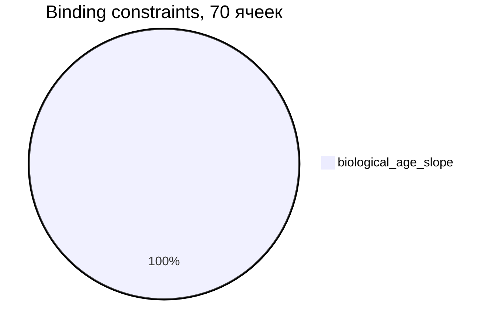
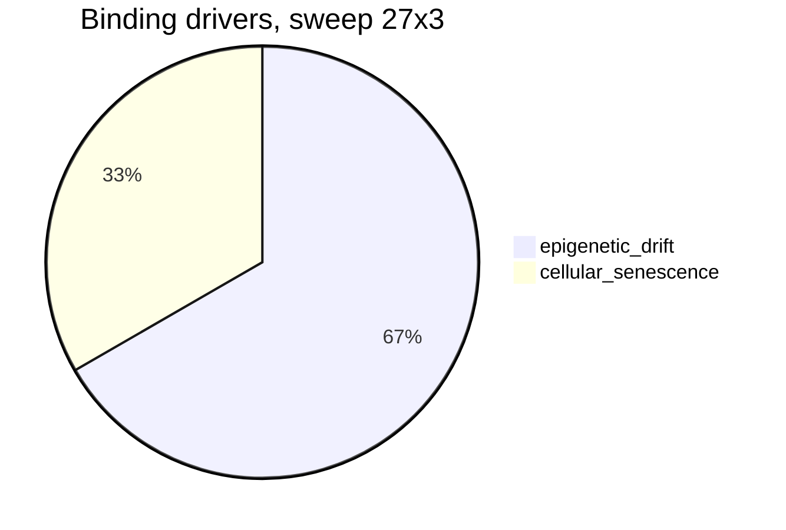

# HUMAN LONGEVITY RESEARCH — презентация прогресса


> **Вопрос проекта:** можно ли построить вычислительную модель человека, достаточно
> подробную, чтобы экспериментально исследовать механизмы старения и понять, какие
> изменения способны замедлять, останавливать или обращать деградацию?
>
> **Правило честности:** «бессмертие» — предельная гипотеза, а не утверждение.
> Модель не подгоняется под ответ. Отрицательный результат — тоже результат.

Слайд-навигация: [Архитектура](#слайд-1-архитектура) ·
[Прогресс](#слайд-2-прогресс) · [Клетка](#слайд-3-клетка) ·
[Ткань](#слайд-4-ткань) · [Орган](#слайд-5-орган) ·
[Организм](#слайд-6-организм) · [Robust](#слайд-7-robust) ·
[Mechanistic](#слайд-8-mechanistic) ·
[Organ-backed](#слайд-9-organ-backed) · [Network](#слайд-10-organ-network) ·
[Reversibility](#слайд-11-reversibility) · [Boundary](#слайд-12-boundary) ·
[Compound wall](#слайд-13-compound-wall) · [Residual](#слайд-14-residual-drivers) ·
[Audit](#слайд-15-audit) · [Цифры](#слайд-16-цифры) ·
[HYP-0](#слайд-17-hyp-0) · [Дальше](#слайд-18-дальше) ·
[Воспроизведение](#слайд-19-воспроизведение)

---

## Слайд 1. Архитектура


```text
СНАЧАЛА ПРАВИЛЬНАЯ НАУЧНАЯ МОДЕЛЬ.
ПОТОМ СИМУЛЯТОР.
ПОТОМ ЭКСПЕРИМЕНТЫ.
ПОТОМ ПРОВЕРКА ГИПОТЕЗ.
```

Детерминизм по seed, checkpoint/restore, инварианты в тестах. Никаких
ML-библиотек в ядре — только stdlib.

---

## Слайд 2. Прогресс

Этапы 1–7, детали — `docs/ROADMAP.md`.

```text
Этапы 1–7:  ███████████████████ 21/21 завершены
HYP-0:      hypothesis_not_proven (честный статус во всех артефактах)
Тесты:      547 passing (детерминизм, инварианты, checkpoint/restore)
```

| Этап | Статус | Одним предложением |
|---|---|---|
| 1 — Научная основа | ✅ | Зафиксированы допущения, архитектура, каталог источников |
| 2 — Модель клетки | ✅ | `Cell`, lineage, теломеры/DNA damage как опции, checkpoint |
| 3 — Раннее развитие | ✅ | Калибровка против данных → **MODEL MISMATCH** |
| 3.5 — Клеточный цикл | ✅ | Стадия-зависимые фазы, частичное закрытие mismatch (модель C) |
| 3A — Ткань | ✅ | Компартментная ткань + политика замены |
| 3B — Карта устойчивости | ✅ | Свип fraction × frequency: плато sustainable + угол коллапса |
| 3C — Граница и контроль | ✅ | Strong рвётся по stem, weak — по ECM |
| 4A — Орган | ✅ | Орган падает по shared-ресурсу при целых тканях |
| 4B — Demand-координация | ✅ | Ни один режим не бьёт independent |
| 4C — Delayed relief | ✅ | Механика работает (realization ~0.96), benefit — нет |
| 4D — Decoupled recovery | ✅ | Recovery стабилизирует; pruning recovery создаёт дефицит |
| 5A — Организм | ✅ | Adaptive control 117.8/100.2; bounded — нигде |
| 5B — Robust + stress | ✅ | Binding везде одно: `biological_age_slope` (70/70) |
| 5C — Mechanistic aging | ✅ | Драйверы разложены; v2 — нигде; доминируют senescence / epigenetic drift |
| 6A — Organ-backed | ✅ | Прокси + ресурсы + координация; лучший 104.8; v3 — нигде, binding везде `biological_age` |
| 6B — Organ-network | ✅ | Рёбра + feedback + hard limits + network age; лучший 76.8; v4 — нигде, binding везде `biological_age` |
| 6C — Reversibility | ✅ | Reversible/irreversible split + conversion + ceiling; лучший 69.8; v5 — нигде, wall `irreversible_accumulation` |
| 6D — Boundary probe | ✅ | Аблации conversion/accrual/ceiling; conversion=0 даёт slope в допуске, но v5 — нигде (открывается bio age) |
| 6E — Compound wall | ✅ | Knife sweep 8×3 без knife-edge + bio-age attribution + sensitivity stable; wall `compound_residual_wall` |
| 6F — Residual drivers | ✅ | Heterogeneous probe 15×3 + sweep 14×3: v5 — нигде, flip нет, joint ablation −17%; wall `diffuse_residual_wall` |
| 7 — Audit | ✅ | Parameter probe 23×3 + criterion variants: v5 — нигде, flip нет, оба драйвера identifiable; audit `robust_diffuse_wall` |
| Дальше (7A+) | ⏳ | Следующий шаг по итогам аудита |

---

## Слайд 3. Клетка

Этапы 1, 2, 3, 3.5.

- Минимальная reference-модель клетки: статусы, деление, смерть, lineage.
- Асинхронные циклы + milestones; калибровка против Istanbul/Hardy.
- **Честный итог:** времена стадий и число клеток бластоцисты моделью не
  закрываются → зафиксирован **MODEL MISMATCH** (`docs/CALIBRATION.md`).
- Этап 3.5 частично закрыл mismatch стадией-зависимыми фазами цикла.

---

## Слайд 4. Ткань

Этапы 3A–3C.

- Компартменты stem / functional / damaged / senescent + ECM / vascular /
  immune / cancer / fibrosis.
- Свип 7 × 5 и расширенная сетка: широкое плато **sustainable**,
  угол коллапса при агрессивной замене.
- Причина отказа зависит от контроля: strong → `stem_depletion`,
  weak → `ecm_failure`.
- **Вывод:** локально устойчивые политики замены существуют, но замена —
  не омоложение организма (HYP-0 не затрагивается).

---

## Слайд 5. Орган

Этапы 4A–4D.

- Орган из двух тканей + shared vascular/immune capacity.
- Проверены: resource-aware scaling, demand-relief приоритеты, immune guard,
  delayed relief + deferral, supply-demand режимы, decoupled recovery.
- **Вывод ветки (отрицательный, зафиксирован):**
  `non-interference remains optimal in the current abstract organ model`.
- Побочный конструктив: recovery сам по себе стабилизирует, а его pruning
  создаёт дефицит — урок ушёл в политики Stage 5A/5C/6A.

---

## Слайд 6. Организм

Этап 5A.

- Жизненный цикл embryo → старость, 8 витальных систем, `biological_age`
  отдельно от хронологического, смерть — отказом систем, не таймером.
- 8 классов вмешательств (у каждого польза **и** цена), 10 политик,
  deterministic policy search.

| Политика | Lifespan | Healthspan | Причина |
|---|---|---|---|
| baseline | 68.0 | 61.8 | systemic_cascade |
| molecular repair | 74.5 | 68.0 | systemic_cascade |
| combined | 80.5 | 73.0 | systemic_cascade |
| **adaptive threshold** | **117.8** | **100.2** | systemic_cascade (cancer ×3.3) |
| search best (repair+senolytic) | 96.2 | 84.8 | — |

- **Вывод:** reactive control доминирует над расписанием; candidate
  immortality policy **не найдена** (bounded 0/27).

---

## Слайд 7. Robust

Этап 5B.

- Multi-seed, параметрический шум, 7 типов шоков, горизонт 250 лет,
  stress suite 9 сценариев.
- Ranking политик стабилен везде; toxicity — самый опасный стресс;
  adaptive constrained срезает cancer на 24% без потери benefit.



- **Вывод:** единственное связывающее ограничение во всех ячейках —
  тренд биологического возраста. Не рак, не резерв, не мозг, не стресс.

---

## Слайд 8. Mechanistic

Этап 5C.

- `biological_age` разложен на **8 драйверов** (DNA, эпигенетика,
  протеостаз, митохондрии, сенесценция, stem, воспаление, cancer-prone).
- 12 driver-targeted вмешательств: цена, риски, diminishing returns,
  пол `adult_age_setpoint` против тривиального «сброса в ноль».

| Политика | Lifespan | Bio slope | Dominant driver |
|---|---|---|---|
| mechanistic baseline | 66.8 | 0.736 | cellular_senescence |
| senolytic only | 67.0 | 0.620 | epigenetic_drift |
| epigenetic only | 67.0 | 0.645 | cellular_senescence (cancer 1.45) |
| **combined** | **70.8** | **0.417** | epigenetic_drift |
| search best | 72.2 | — | v2 false везде |



- **Вывод:** комбинированная терапия почти вдвое режет bio slope, но до
  bounded далеко; чинишь один драйвер — binding смещается на следующий.

---

## Слайд 9. Organ-backed

Этап 6A: витальные системы частично опираются на reduced organ proxies.

- 8 прокси (идеи Stage 4, не симуляция клеток) + 4 системных ресурса
  (perfusion/immune/metabolic/repair) + 5 coordination modes.
- Часть драйверов частично эмерджентна (senescence/inflammation — 0.5).

| Политика | Lifespan | Healthspan | Binding |
|---|---|---|---|
| organ-backed baseline | 82.8 | 71.8 | biological_age_slope |
| organ maintenance | 88.0 | 76.0 | biological_age_slope |
| **combined organ-backed** | **101.5** | **87.2** | biological_age_slope |
| adaptive cross-scale | 97.5 | 82.2 | biological_age_slope |
| search best (12×3) | 104.8 | — | v3 false везде |

- Coordination: independent = deferral = lookahead; scaling −0.25 —
  non-interference подтверждён уровнем выше.
- Repair — критичнейший ресурс (бюджет 4 → ~76–79; ≥8 → 101–110).
- Stress 3×7×3: ranking стабилен; v3 — нигде.

---

## Слайд 10. Organ-network

Этап 6B: межорганные связи, feedback-контуры и жёсткие физические /
информационные ограничения.

- 12 рёбер (vascular/immune/metabolic/сигналы/spread/seeding/repair flow)
  + 7 feedback loops с gain и runaway-детекцией + hard limits
  (energy/information/mutation/irreversible/niche/toxicity).
- Сетевой биологический возраст с полом adult setpoint.

| Политика | Lifespan | Healthspan | Binding |
|---|---|---|---|
| network baseline | 67.0 | 58.2 | biological_age_slope |
| network maintenance | 73.0 | 65.0 | biological_age_slope |
| **network combined** | **76.5** | **68.8** | biological_age_slope |
| network adaptive | 76.8 | 70.2 | biological_age_slope |
| search best (12×3) | 75.2 | 67.5 | v4 false везде |

- Сеть утяжеляет baseline 6A (82.8 → 67.0): рёбра и feedback — реальная
  нагрузка; dominant edge `cardio_vascular_to_brain`.
- Coordination 6×3: все режимы 76.5, gain 0.0 — non-interference
  подтверждён на сетевом уровне.
- Repair снова критичен; energy сам по себе исхода не меняет; v4 — нигде.

---

## Слайд 11. Reversibility

Этап 6C: повреждения делятся на reversible и irreversible
(идея Stage 5D внутри organ-network архитектуры).

- Per-driver/per-organ ledger (`damage = reversible + irreversible`),
  conversion с модификаторами, repair ceiling с ценой/риском/diminishing,
  information debt, mutation fixation, niche disorder, entropy;
  bio-возраст с динамическим irreversible floor.
- 9 новых вмешательств (clearance, suppression, prevention,
  irreversible repair, info/mutation/niche/entropy, combined).

| Политика | Lifespan | Healthspan | Стена |
|---|---|---|---|
| reversibility baseline | 67.0 | 58.2 | irreversible_accumulation |
| preventive only | 68.2 | 59.2 | biological_age_slope |
| clearance only | 69.0 | 60.5 | biological_age_slope |
| irreversible repair only | 67.0 | 58.2 | потолок не тронут |
| **combined preventive+clearance** | **69.5** | **60.5** | irreversible_accumulation |
| aggressive reversal | 69.0 | 60.5 | долги растут |
| neural preserving | 69.8 | 61.0 | continuity держится |
| search best (6×3) | 68.8 | 60.2 | v5 false везде |

- Reversible slope удержим (0.002–0.003), irreversible — нет
  (0.003–0.005 против eps 0.004); conversion — главный механизм:
  rate 0.05 роняет lifespan 69.5 → 60.5 (−9 лет).
- Repair ceiling sweep плоский — потолок не binding, политика его не
  исчерпывает; coordination 4×3 — все 69.5.

---

## Слайд 12. Boundary

Этап 6D: диагностический boundary probe — аблации, а не новая биология.

- Opt-in `boundary_probe_model` (scales conversion/accrual/ceiling,
  component overrides, disable/unlimited флаги; unlimited — exploratory).
- Contribution decomposition (`conversion + independent − repair = net`
  по компонентам), source attribution, wall classification.

| Аблация | Lifespan | Irreversible slope | v5 |
|---|---|---|---|
| default | 69.5 | 0.00536 | false |
| conversion_zero | 69.5 | 0.00082 (в допуске!) | false |
| independent_zero | 69.5 | 0.00501 | false |
| both_suppressed | 69.5 | ~0.0008 | false |
| high/unlimited ceiling | 69.5 | — | false |

- Подавление conversion ограничивает irreversible slope, но v5 всё
  равно false — binding смещается на `biological_age_slope` (исход 2).
- Attribution: default → `conversion` / `driver:stem_exhaustion`;
  conversion_zero → `independent_irreversible_accrual` /
  `driver:dna_damage`; both_suppressed → `information_debt`.
- Ultra-свипы 9+9+7 точек, search, stress: v5 false везде, порога нет.
- Wall: `parametric_irreversibility_wall` — компонент подавим, v5 как
  целое недостижима.

---

## Слайд 13. Compound wall

Этап 6E: knife-edge probe + bio-age attribution + sensitivity — проверка,
не является ли стена 6D узким параметрическим эффектом.

- Knife-edge sweep 8×3 (0.0 … 1.0 при independent=0): v5=false везде,
  включая 1e-6 — knife-edge нет, порога нет; source `conversion` (≥0.01)
  → `information_debt` (≤0.001).
- Bio-age attribution (веса модели, diagnostic proxy): total slope ≈ 1.33,
  dominant `proteostasis_loss` → `proteostasis_metabolic` (0.69), далее
  `stem_exhaustion` (0.23); residual −0.014 (~99% объяснено); значимых
  источников — 3; стабильна по аблациям.
- Sensitivity eps×dt×seed (60 прогонов, v5 переоценён без реранов):
  eps/dt/seed stable все true; v5=false во всех 36 ячейках.
- Compound wall (sensitivity и attribution независимо):
  `compound_residual_wall` — irreversible подавлен, v5 false, binding
  `biological_age_slope`, ≥2 остаточных источника.

---

## Слайд 14. Residual drivers

Этап 6F: гетерогенный зонд составной остаточной стены — точечное
подавление top-драйверов `biological_age_slope` существующими
механизмами (`aging_drivers` + `component_overrides`), без новой
биологии и без изменения динамики 6C/6D/6E.

- Probe 15×3: `proteostasis_metabolic` / `stem_exhaustion` по шкалам
  1.0 / 0.5 / 0.25 / 0.0 + комбинации; sweep 14×3: все 6 групп +
  joint ablation. `driver_scale=1.0` бит-в-бит равен control.

| Режим | v5 | Bio slope | Binding |
|---|---|---|---|
| control | false | 1.33 | biological_age_slope |
| probe singles + combos | false | −0.6% max | без смены |
| sweep singles (6 групп) | false | −8.5% max | без смены |
| sweep joint ablation | false | −17% (1.33 → 1.10) | без смены |

- v5=false в 29/29 режимах; source flip нет; dominant источник везде
  `proteostasis_metabolic`; порог substantial-эффекта (20%) не
  достигнут ни в одном режиме.
- Residual wall: `diffuse_residual_wall` (диффузная остаточная стена),
  уверенность средняя — стена распределена по нескольким каналам
  текущей абстракции, а не держится на одном removable драйвере.
  HYP-0 остаётся `hypothesis_not_proven`.

---

## Слайд 15. Audit

Этап 7: audit устойчивости диффузной стены к вариациям критерия v5
и параметров — проверка качества самой диагностики, не поиск v5.

- Parameter probe 23×3: веса top drivers 0.5/1.0/2.0, ledger scales
  0.75/1.0/1.25/1.5, explicit combos; mult 1.0 бит-в-бит равен control.
- Criterion probe (всё задекларировано до прогона, без реранов):
  горизонты 100/150/200, пороги ±10/±20%, агрегации
  global/network/reversibility, estimators
  least_squares/endpoint/trailing_window.
- v5=false в 23/23 режимах и во всех criterion variants; binding и
  dominant источник не меняются нигде; оба драйвера responsive
  (proteostasis +51%, stem +17%) — `identifiable`.
- Audit: `robust_diffuse_wall` (устойчивая диффузная стена),
  уверенность высокая. HYP-0 остаётся `hypothesis_not_proven`.

---

## Слайд 16. Цифры

Lifespan лучших политик (масштаб: 30 символов = 117.8 лет):

```text
baseline 5A            68.0  █████████████████
combined 5A            80.5  █████████████████████
search best 5A         96.2  █████████████████████████
adaptive 5A           117.8  ██████████████████████████████
combined mech 5C       70.8  ██████████████████
search best mech 5C    72.2  ██████████████████
combined backed 6A   101.5  ██████████████████████████
combined network 6B    76.5  ███████████████████
combined revers 6C     69.5  ██████████████████
boundary 6D            69.5  ██████████████████
compound 6E            69.5  ██████████████████
hetero 6F             69.5  ██████████████████
audit 7              69.5  ██████████████████
```

- Healthspan ≤ lifespan — всегда (инвариант, покрыт тестами).
- Bounded degradation (v1, строгий v2, organ-backed v3, network v4,
  reversibility v5): **0 везде** — ни одна политика, ни один сид,
  ни один стресс, ни одна аблация, ни один eps/dt, ни один
  гетерогенный режим, ни один audit-режим, ни один criterion variant.
- Тесты: **547 passing**. Артефакты — в `experiments/output/`.

---

## Слайд 17. HYP-0

```text
HYP-0: hypothesis_not_proven
```

1. Biological age slope после зрелости ограничен? — **Нет**, нигде.
2. Ни один драйвер без runaway trend? — **Нет** (senescence / epigenetic drift).
3. Витальные системы с запасом? — Падают каскадом при целых порогах.
4. Рак/воспаление/фиброз/continuity в пределах? — Да, но это не binding.
5. Устойчивость к seed/шуму/стрессу? — Ranking стабилен, bounded нет.
6. Organ-backed v3 (органы + ресурсы)? — Нет нигде; binding level везде `biological_age`.
7. Network v4 (рёбра + feedback + hard limits)? — Нет нигде; binding везде `biological_age`.
8. Reversibility v5 (conversion + ceiling + info/mutation/niche)? — Нет
   нигде; dominant wall `irreversible_accumulation` / conversion.
9. Boundary 6D (подавление irreversible flux)? — Slope в допуске при
   conversion=0, но v5 всё равно нет: открывается `biological_age_slope`.
   Wall: `parametric_irreversibility_wall`.
10. Compound 6E (knife-edge + sensitivity)? — v5=false в 8/8 и 36/36;
    knife-edge нет; attribution стабильна; wall `compound_residual_wall`.
11. Heterogeneous 6F (точечное подавление top drivers)? — v5=false в
    29/29 режимах; binding везде `biological_age_slope`; flip нет;
    joint ablation всех групп −17% (ниже порога 20%); wall
    `diffuse_residual_wall`.
12. Audit 7 (устойчивость критерия и параметров)? — v5=false в 23/23
    режимах и во всех criterion variants; flip нет; оба драйвера
    identifiable; audit `robust_diffuse_wall`.

> Candidate policy не найдена — это граница текущей абстрактной модели,
> а не опровержение гипотезы в реальности. Даже найденный кандидат был бы
> лишь операциональным флагом внутри модели, не доказательством бессмертия.

Статус: `research/hypotheses/HYP-0_immortality_policy.md`.

---

## Слайд 18. Дальше

```text
Stage 6D сказал: conversion подавим, но v5 всё равно нет — за стеной вторая стена.
Stage 6E сказал: вторая стена составная (bio-age + info, ≥2 источников), стабильна по eps/dt/seed.
Stage 6F сказал: точечное подавление top-драйверов v5 не снимает — остаточная стена диффузная.
Stage 7 сказал: диффузная стена устойчива к вариациям критерия и параметров в проверенных диапазонах.
```

- **Stage 6E** — done: knife-edge нет, attribution стабильна
  (dominant `proteostasis_metabolic`), sensitivity стабильна, wall —
  `compound_residual_wall`.
- **Stage 6F** — done: точечное подавление top drivers (15×3) и всех
  групп (14×3) не снимает v5 и не смещает binding — остаточная стена
  диффузная (`diffuse_residual_wall`), attenuation частично поглощается
  repair/coupling текущей абстракции.
- **Stage 7** — done: parameter probe (23×3) и criterion variants не
  меняют вердикт — диффузная стена устойчива (`robust_diffuse_wall`,
  уверенность высокая), оба драйвера identifiable.
- Следующий шаг — решить по итогам аудита: закрыть diagnostic ветку
  6/7, calibration branch, criterion protocol (7A) или механистическая
  ветка (energy-coupled conversion) только отдельным решением.

---

## Слайд 19. Воспроизведение

```bash
python -m pip install -e ".[dev]"
python -m pytest   # 547 passing
```

```bash
$env:PYTHONPATH='src'; python -m longevity.experiment.organism_runner --config experiments/configs/organism_aging_combined_mechanistic.json --out experiments/output/organism_aging_combined_mechanistic.json
$env:PYTHONPATH='src'; python -m longevity.experiment.organism_policy_search --config experiments/configs/organism_aging_robust_search_mini.json --out-prefix experiments/output/organism_aging_robust_search_mini
$env:PYTHONPATH='src'; python -m longevity.experiment.organism_robust --config experiments/configs/organism_aging_stress_mechanistic.json --out-prefix experiments/output/organism_aging_stress_mechanistic
$env:PYTHONPATH='src'; python -m longevity.experiment.organism_runner --config experiments/configs/organism_organ_backed_combined.json --out experiments/output/organism_organ_backed_combined.json
$env:PYTHONPATH='src'; python -m longevity.experiment.organism_organ_backed --config experiments/configs/organism_organ_backed_coordination_compare.json --out-prefix experiments/output/organism_organ_backed_coordination_compare
$env:PYTHONPATH='src'; python -m longevity.experiment.organism_runner --config experiments/configs/organism_organ_network_combined.json --out experiments/output/organism_organ_network_combined.json
$env:PYTHONPATH='src'; python -m longevity.experiment.organism_organ_network --config experiments/configs/organism_organ_network_coordination_compare.json --out-prefix experiments/output/organism_organ_network_coordination_compare
$env:PYTHONPATH='src'; python -m longevity.experiment.organism_runner --config experiments/configs/organism_reversibility_combined_preventive_clearance.json --out experiments/output/organism_reversibility_combined_preventive_clearance.json
$env:PYTHONPATH='src'; python -m longevity.experiment.organism_reversibility --config experiments/configs/organism_reversibility_coordination_compare.json --out-prefix experiments/output/organism_reversibility_coordination_compare
$env:PYTHONPATH='src'; python -m longevity.experiment.organism_runner --config experiments/configs/organism_reversibility_boundary_both_suppressed.json --out experiments/output/organism_reversibility_boundary_both_suppressed.json
$env:PYTHONPATH='src'; python -m longevity.experiment.organism_boundary --config experiments/configs/organism_reversibility_boundary_conversion_ultra_sweep.json --out-prefix experiments/output/organism_reversibility_boundary_conversion_ultra_sweep
$env:PYTHONPATH='src'; python -m longevity.experiment.organism_runner --config experiments/configs/organism_reversibility_boundary_knife_edge_conversion_1e-4.json --out experiments/output/organism_reversibility_boundary_knife_edge_conversion_1e-4.json
$env:PYTHONPATH='src'; python -m longevity.experiment.organism_boundary --config experiments/configs/organism_reversibility_boundary_knife_edge_sweep.json --out-prefix experiments/output/organism_reversibility_boundary_knife_edge_sweep
$env:PYTHONPATH='src'; python -m longevity.experiment.organism_boundary --config experiments/configs/organism_reversibility_boundary_compound_attribution.json --out-prefix experiments/output/organism_reversibility_boundary_compound_attribution
$env:PYTHONPATH='src'; python -m longevity.experiment.organism_boundary --config experiments/configs/organism_reversibility_boundary_sensitivity.json --out-prefix experiments/output/organism_reversibility_boundary_sensitivity
$env:PYTHONPATH='src'; python -m longevity.experiment.organism_boundary --config experiments/configs/organism_reversibility_boundary_heterogeneous_probe.json --out-prefix experiments/output/organism_reversibility_boundary_heterogeneous_probe
$env:PYTHONPATH='src'; python -m longevity.experiment.organism_boundary --config experiments/configs/organism_reversibility_boundary_heterogeneous_sweep.json --out-prefix experiments/output/organism_reversibility_boundary_heterogeneous_sweep
$env:PYTHONPATH='src'; python -m longevity.experiment.organism_boundary --config experiments/configs/organism_reversibility_boundary_stage7_audit.json --out-prefix experiments/output/organism_reversibility_boundary_stage7_audit
```

Документы: `docs/ROADMAP.md` (план), `docs/AGING_MODEL.md` (Stage 5C),
`docs/ORGAN_BACKED_ORGANISM_MODEL.md` (Stage 6A),
`docs/ORGAN_NETWORK_MODEL.md` (Stage 6B),
`docs/REVERSIBILITY_MODEL.md` (Stage 6C + boundary probe 6D + compound wall 6E + heterogeneous probe 6F + robustness audit 7),
`docs/ORGANISM_MODEL.md` (§8–14), `docs/IMMORTALITY.md` (§6–12).
