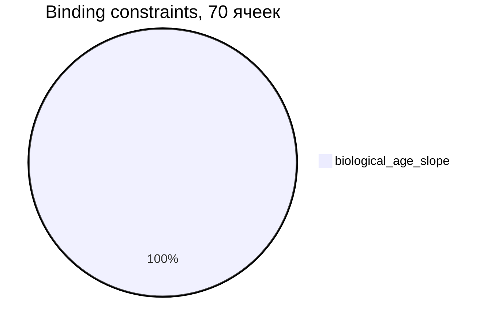
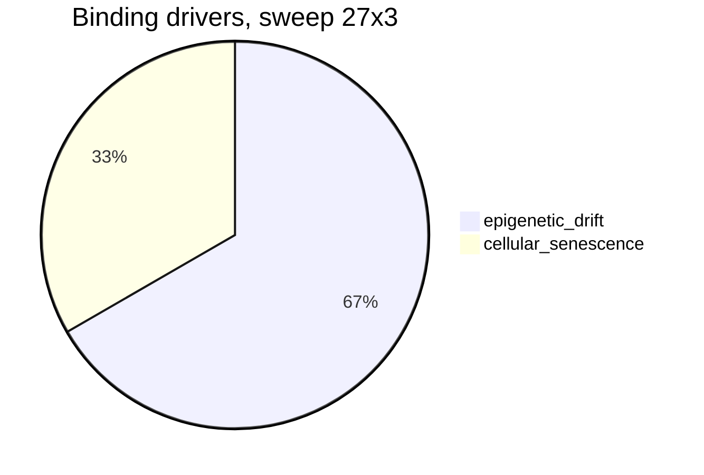

# HUMAN LONGEVITY RESEARCH — презентация прогресса


> **Вопрос проекта:** можно ли построить вычислительную модель человека, достаточно
> подробную, чтобы экспериментально исследовать механизмы старения и понять, какие
> изменения способны замедлять, останавливать или обращать деградацию?
>
> **Правило честности:** «бессмертие» — предельная гипотеза, а не утверждение.
> Модель не подгоняется под ответ. Отрицательный результат — тоже результат.

Слайд-навигация: [Архитектура](#слайд-1-архитектура) ·
[Прогресс](#слайд-2-прогресс) · [Клетка](#слайд-3-клетка) ·
[Ткань](#слайд-4-ткань) · [Орган](#слайд-5-орган) ·
[Организм](#слайд-6-организм) · [Robust](#слайд-7-robust) ·
[Mechanistic](#слайд-8-mechanistic) ·
[Organ-backed](#слайд-9-organ-backed) · [Цифры](#слайд-10-цифры) ·
[HYP-0](#слайд-11-hyp-0) · [Дальше](#слайд-12-дальше) ·
[Воспроизведение](#слайд-13-воспроизведение)

---

## Слайд 1. Архитектура


```text
СНАЧАЛА ПРАВИЛЬНАЯ НАУЧНАЯ МОДЕЛЬ.
ПОТОМ СИМУЛЯТОР.
ПОТОМ ЭКСПЕРИМЕНТЫ.
ПОТОМ ПРОВЕРКА ГИПОТЕЗ.
```

Детерминизм по seed, checkpoint/restore, инварианты в тестах. Никаких
ML-библиотек в ядре — только stdlib.

---

## Слайд 2. Прогресс

Этапы 1–6A, детали — `docs/ROADMAP.md`.

```text
Этапы 1–6A:  ███████████████ 15/15 завершены
```

| Этап | Статус | Одним предложением |
|---|---|---|
| 1 — Научная основа | ✅ | Зафиксированы допущения, архитектура, каталог источников |
| 2 — Модель клетки | ✅ | `Cell`, lineage, теломеры/DNA damage как опции, checkpoint |
| 3 — Раннее развитие | ✅ | Калибровка против данных → **MODEL MISMATCH** |
| 3.5 — Клеточный цикл | ✅ | Стадия-зависимые фазы, частичное закрытие mismatch (модель C) |
| 3A — Ткань | ✅ | Компартментная ткань + политика замены |
| 3B — Карта устойчивости | ✅ | Свип fraction × frequency: плато sustainable + угол коллапса |
| 3C — Граница и контроль | ✅ | Strong рвётся по stem, weak — по ECM |
| 4A — Орган | ✅ | Орган падает по shared-ресурсу при целых тканях |
| 4B — Demand-координация | ✅ | Ни один режим не бьёт independent |
| 4C — Delayed relief | ✅ | Механика работает (realization ~0.96), benefit — нет |
| 4D — Decoupled recovery | ✅ | Recovery стабилизирует; pruning recovery создаёт дефицит |
| 5A — Организм | ✅ | Adaptive control 117.8/100.2; bounded — нигде |
| 5B — Robust + stress | ✅ | Binding везде одно: `biological_age_slope` (70/70) |
| 5C — Mechanistic aging | ✅ | Драйверы разложены; v2 — нигде; доминируют senescence / epigenetic drift |
| 6A — Organ-backed | ✅ | Прокси + ресурсы + координация; лучший 104.8; v3 — нигде, binding везде `biological_age` |
| Дальше | 5D / 6B | ⏳ | Более глубокая обратимость или следующий cross-scale шаг |

---

## Слайд 3. Клетка

Этапы 1, 2, 3, 3.5.

- Минимальная reference-модель клетки: статусы, деление, смерть, lineage.
- Асинхронные циклы + milestones; калибровка против Istanbul/Hardy.
- **Честный итог:** времена стадий и число клеток бластоцисты моделью не
  закрываются → зафиксирован **MODEL MISMATCH** (`docs/CALIBRATION.md`).
- Этап 3.5 частично закрыл mismatch стадией-зависимыми фазами цикла.

---

## Слайд 4. Ткань

Этапы 3A–3C.

- Компартменты stem / functional / damaged / senescent + ECM / vascular /
  immune / cancer / fibrosis.
- Свип 7 × 5 и расширенная сетка: широкое плато **sustainable**,
  угол коллапса при агрессивной замене.
- Причина отказа зависит от контроля: strong → `stem_depletion`,
  weak → `ecm_failure`.
- **Вывод:** локально устойчивые политики замены существуют, но замена —
  не омоложение организма (HYP-0 не затрагивается).

---

## Слайд 5. Орган

Этапы 4A–4D.

- Орган из двух тканей + shared vascular/immune capacity.
- Проверены: resource-aware scaling, demand-relief приоритеты, immune guard,
  delayed relief + deferral, supply-demand режимы, decoupled recovery.
- **Вывод ветки (отрицательный, зафиксирован):**
  `non-interference remains optimal in the current abstract organ model`.
- Побочный конструктив: recovery сам по себе стабилизирует, а его pruning
  создаёт дефицит — урок ушёл в политики Stage 5A/5C/6A.

---

## Слайд 6. Организм

Этап 5A.

- Жизненный цикл embryo → старость, 8 витальных систем, `biological_age`
  отдельно от хронологического, смерть — отказом систем, не таймером.
- 8 классов вмешательств (у каждого польза **и** цена), 10 политик,
  deterministic policy search.

| Политика | Lifespan | Healthspan | Причина |
|---|---|---|---|
| baseline | 68.0 | 61.8 | systemic_cascade |
| molecular repair | 74.5 | 68.0 | systemic_cascade |
| combined | 80.5 | 73.0 | systemic_cascade |
| **adaptive threshold** | **117.8** | **100.2** | systemic_cascade (cancer ×3.3) |
| search best (repair+senolytic) | 96.2 | 84.8 | — |

- **Вывод:** reactive control доминирует над расписанием; candidate
  immortality policy **не найдена** (bounded 0/27).

---

## Слайд 7. Robust

Этап 5B.

- Multi-seed, параметрический шум, 7 типов шоков, горизонт 250 лет,
  stress suite 9 сценариев.
- Ranking политик стабилен везде; toxicity — самый опасный стресс;
  adaptive constrained срезает cancer на 24% без потери benefit.



- **Вывод:** единственное связывающее ограничение во всех ячейках —
  тренд биологического возраста. Не рак, не резерв, не мозг, не стресс.

---

## Слайд 8. Mechanistic

Этап 5C.

- `biological_age` разложен на **8 драйверов** (DNA, эпигенетика,
  протеостаз, митохондрии, сенесценция, stem, воспаление, cancer-prone).
- 12 driver-targeted вмешательств: цена, риски, diminishing returns,
  пол `adult_age_setpoint` против тривиального «сброса в ноль».

| Политика | Lifespan | Bio slope | Dominant driver |
|---|---|---|---|
| mechanistic baseline | 66.8 | 0.736 | cellular_senescence |
| senolytic only | 67.0 | 0.620 | epigenetic_drift |
| epigenetic only | 67.0 | 0.645 | cellular_senescence (cancer 1.45) |
| **combined** | **70.8** | **0.417** | epigenetic_drift |
| search best | 72.2 | — | v2 false везде |



- **Вывод:** комбинированная терапия почти вдвое режет bio slope, но до
  bounded далеко; чинишь один драйвер — binding смещается на следующий.

---

## Слайд 9. Organ-backed

Этап 6A: витальные системы частично опираются на reduced organ proxies.

- 8 прокси (идеи Stage 4, не симуляция клеток) + 4 системных ресурса
  (perfusion/immune/metabolic/repair) + 5 coordination modes.
- Часть драйверов частично эмерджентна (senescence/inflammation — 0.5).

| Политика | Lifespan | Healthspan | Binding |
|---|---|---|---|
| organ-backed baseline | 82.8 | 71.8 | biological_age_slope |
| organ maintenance | 88.0 | 76.0 | biological_age_slope |
| **combined organ-backed** | **101.5** | **87.2** | biological_age_slope |
| adaptive cross-scale | 97.5 | 82.2 | biological_age_slope |
| search best (12×3) | 104.8 | — | v3 false везде |

- Coordination: independent = deferral = lookahead; scaling −0.25 —
  non-interference подтверждён уровнем выше.
- Repair — критичнейший ресурс (бюджет 4 → ~76–79; ≥8 → 101–110).
- Stress 3×7×3: ranking стабилен; v3 — нигде.

---

## Слайд 10. Цифры

Lifespan лучших политик (масштаб: 30 символов = 117.8 лет):

```text
baseline 5A            68.0  █████████████████
combined 5A            80.5  █████████████████████
search best 5A         96.2  █████████████████████████
adaptive 5A           117.8  ██████████████████████████████
combined mech 5C       70.8  ██████████████████
search best mech 5C    72.2  ██████████████████
combined backed 6A   101.5  ██████████████████████████
```

- Healthspan ≤ lifespan — всегда (инвариант, покрыт тестами).
- Bounded degradation (v1, строгий v2, organ-backed v3): **0 везде** —
  ни одна политика, ни один сид, ни один стресс.
- Тесты: **364 passing**. Артефакты: ~217 файлов в `experiments/output/`.

---

## Слайд 11. HYP-0

```text
HYP-0: hypothesis_not_proven
```

1. Biological age slope после зрелости ограничен? — **Нет**, нигде.
2. Ни один драйвер без runaway trend? — **Нет** (senescence / epigenetic drift).
3. Витальные системы с запасом? — Падают каскадом при целых порогах.
4. Рак/воспаление/фиброз/continuity в пределах? — Да, но это не binding.
5. Устойчивость к seed/шуму/стрессу? — Ranking стабилен, bounded нет.
6. Organ-backed v3 (органы + ресурсы)? — Нет нигде; binding level везде `biological_age`.

> Candidate policy не найдена — это граница текущей абстрактной модели,
> а не опровержение гипотезы в реальности. Даже найденный кандидат был бы
> лишь операциональным флагом внутри модели, не доказательством бессмертия.

Статус: `research/hypotheses/HYP-0_immortality_policy.md`.

---

## Слайд 12. Дальше

```text
Stage 5C сказал: чинишь один драйвер — binding смещается на следующий.
```

- **Stage 6A** — done: organ-backed buffering продлевает жизнь
  (101.5), но bounded не открывает.
- **Stage 5D** — более глубокие механизмы обратимости с явными
  физическими и ресурсными пределами.
- Открытый вопрос: есть ли в модели конфигурация, где *все* драйверы
  одновременно bounded без неприемлемой цены?

---

## Слайд 13. Воспроизведение

```bash
python -m pip install -e ".[dev]"
python -m pytest   # 364 passing
```

```bash
$env:PYTHONPATH='src'; python -m longevity.experiment.organism_runner --config experiments/configs/organism_aging_combined_mechanistic.json --out experiments/output/organism_aging_combined_mechanistic.json
$env:PYTHONPATH='src'; python -m longevity.experiment.organism_policy_search --config experiments/configs/organism_aging_robust_search_mini.json --out-prefix experiments/output/organism_aging_robust_search_mini
$env:PYTHONPATH='src'; python -m longevity.experiment.organism_robust --config experiments/configs/organism_aging_stress_mechanistic.json --out-prefix experiments/output/organism_aging_stress_mechanistic
$env:PYTHONPATH='src'; python -m longevity.experiment.organism_runner --config experiments/configs/organism_organ_backed_combined.json --out experiments/output/organism_organ_backed_combined.json
$env:PYTHONPATH='src'; python -m longevity.experiment.organism_organ_backed --config experiments/configs/organism_organ_backed_coordination_compare.json --out-prefix experiments/output/organism_organ_backed_coordination_compare
```

Документы: `docs/ROADMAP.md` (план), `docs/AGING_MODEL.md` (Stage 5C),
`docs/ORGAN_BACKED_ORGANISM_MODEL.md` (Stage 6A),
`docs/ORGANISM_MODEL.md` (§8–10), `docs/IMMORTALITY.md` (§6–8).
